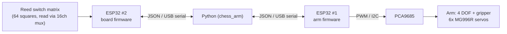

# ♟️ Chess Robot Arm

A robotic arm that plays chess against a human on a real board: 64 reed
switches sense which squares are occupied, one ESP32 reports that state,
a second ESP32 drives the arm's 6 servos (4 DOF + gripper), and a Python
program on the PC runs the actual chess logic and move planning.

<p align="center">
  
</p>

<p align="center">
  
  
  
  
  
</p>

## How it works

1. A human moves a physical piece. The 8x8 reed switch matrix under the
   board (read through a 16-channel analog multiplexer) detects which
   square emptied and which one filled.
2. **ESP32 #1** (board) reports that as a raw occupancy string over USB
   serial.
3. The PC matches the change to a legal chess move (`python-chess`), and if
   it's the arm's turn, computes a reply move (Stockfish if installed,
   otherwise a random legal move as a zero-dependency fallback).
4. The move is turned into a sequence of joint waypoints — including
   captures (piece parked in a "graveyard" slot), en passant, and castling
   — and streamed to **ESP32 #2** (arm), which drives all 6 servos through
   a PCA9685 PWM driver, smoothly interpolating each joint.

Full breakdown, including *why* the system is split this way, in
[`docs/architecture.md`](docs/architecture.md). Wire-level pin choices are
in [`docs/wiring.md`](docs/wiring.md). The exact serial message formats are
in [`docs/protocol.md`](docs/protocol.md).



## Repo structure

```
BRAZO_ROBOTICO/
├── firmware/
│   ├── esp32_arm/               ESP32 #1: arm control (PlatformIO)
│   │   └── src/
│   │       ├── config.h          I2C pins, PCA9685 address, joint->channel map
│   │       ├── ArmController.*   Smooth multi-joint interpolation via PCA9685
│   │       ├── Protocol.*        JSON serial protocol
│   │       └── main.cpp
│   └── esp32_board/              ESP32 #2: board sensing (PlatformIO)
│       └── src/
│           ├── config.h          Row pins, mux select/signal pins
│           ├── ReedMatrix.*      8x8 matrix scan via 16ch analog mux
│           ├── Protocol.*        JSON serial protocol
│           └── main.cpp
├── software/                     PC side (Python)
│   ├── chess_arm/
│   │   ├── serial_link.py        Threaded serial transport
│   │   ├── board_state.py        Raw matrix -> square diff
│   │   ├── game_engine.py        python-chess + optional Stockfish
│   │   ├── move_planner.py       Move -> joint waypoints (captures, en passant, castling)
│   │   ├── calibration.py        Per-square servo angle calibration
│   │   └── main.py               Game loop entry point (opens both serial links)
│   ├── config/calibration.example.json
│   └── tests/                    pytest suite, no hardware required
├── scripts/
│   ├── calibrate.py              Interactive tool to build calibration.json
│   └── make_gif.sh               Convert a phone video into a repo-ready GIF
├── docs/                         architecture.md, wiring.md, protocol.md
└── media/                        Photos/GIFs of the arm in action
```

## Hardware

Two ESP32s, each with its own USB link to the PC — see
[`docs/architecture.md`](docs/architecture.md) for why.

**Microcontrollers**
- ESP32 #1 — arm control
- ESP32 #2 — board + multiplexer control

**Control & actuators**
- PCA9685 16-channel PWM driver (drives all 6 servos over I2C)
- 16-channel analog multiplexer (reads the reed switch matrix columns)

**Arm — 4 DOF + gripper, 6x MG996R digital hi-torque servos**
| Joint | Servos | Notes |
|---|---|---|
| M1 — Base | 1 | Rotation |
| M2 — 1st articulation (shoulder) | 2 | Paired for extra torque |
| M3 — 2nd articulation (elbow) | 1 | |
| M4 — 3rd articulation (wrist) | 1 | |
| M5 — Gripper | 1 | End effector |

**Power & distribution**
- Buslinker v2.5 power distribution module
- 100µF 16V capacitor (rail smoothing)
- Blue screw-terminal connectors
- Red/black power cable (servo rail)
- External 5-6V supply sized for 6 servos

**Board**
- 64x reed switches (8x8 matrix, columns read via the mux)

**Prototyping**
- Breadboard, jumper wires, multichannel terminal connectors
- Potentiometer (manual angle jogging during bring-up/calibration)

**Other**
- Expansion/sensor module (spare I/O for future additions)

Full pin-level detail in [`docs/wiring.md`](docs/wiring.md).

## Getting started

### 1. Firmware (both ESP32s)

Requires [PlatformIO](https://platformio.org/) (CLI or the VS Code
extension). Flash each board from its own project directory:

```bash
# ESP32 #1 -- arm
cd firmware/esp32_arm
pio run --target upload
pio device monitor

# ESP32 #2 -- board
cd firmware/esp32_board
pio run --target upload
pio device monitor
```

Check each project's `src/config.h` against your actual wiring before
flashing (see [`docs/wiring.md`](docs/wiring.md)).

### 2. PC software

```bash
cd software
python3 -m venv .venv
source .venv/bin/activate
pip install -e ".[dev]"
```

Build a calibration file for your arm (maps each square to joint angles;
only needs the arm ESP32 connected):

```bash
python ../scripts/calibrate.py --arm-port /dev/ttyUSB1 --out config/calibration.json
```

Then play a game — both ESP32s need to be connected, each on its own port:

```bash
python -m chess_arm.main \
  --board-port /dev/ttyUSB0 --arm-port /dev/ttyUSB1 \
  --calibration config/calibration.json --human-color white
```

Optional: install [Stockfish](https://stockfishchess.org/) and pass
`--stockfish /path/to/stockfish` (or just have it on `PATH`) for a real
opponent instead of random legal moves.

### 3. Run the tests

```bash
cd software
pytest
```

## Media

<p align="center">
  
  
</p>

More photos in [`media/photos/`](media/photos/).

## Roadmap

- [ ] Full 64-square + graveyard calibration
- [ ] Handle promotions with a physical piece swap prompt
- [ ] Optional: onboard OLED/LED status on either ESP32
- [ ] Optional: swap the gripper for an electromagnet variant

## License

[MIT](LICENSE)

## Author

**Alejandra Obando Cortes**
Mechatronics Engineering Student | Robotics & Embedded Systems

- 📧 [obandoaleja281@gmail.com](mailto:obandoaleja281@gmail.com)
- 💼 [LinkedIn](https://www.linkedin.com/in/alejandra-obando-cortes-b485223a4/)
- 💻 [GitHub](https://github.com/alejandra-obando)

Built as an end-to-end embedded + robotics + software project: dual-ESP32
firmware (C++/PlatformIO), PWM/I2C servo control, sensor-matrix design, and
a Python game engine talking to it all over serial. Reach out on LinkedIn
or open an issue if you're building something similar — or if you're
hiring for embedded/robotics/software roles.
