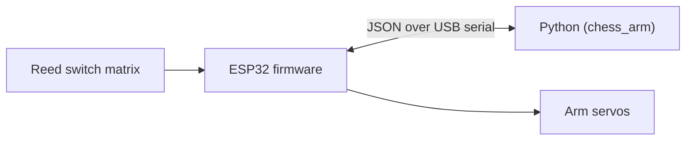

# ♟️ Chess Robot Arm

A robotic arm that plays chess against a human on a real board: 64 reed
switches sense which squares are occupied, an ESP32 reports that state and
drives the arm's servos, and a Python program on the PC runs the actual
chess logic and move planning.

<!--
Once media/demo.gif exists (see media/README.md), uncomment this:

<p align="center">
  
</p>
-->

> 🎥 Demo GIF coming soon — see [`media/README.md`](media/README.md) for how
> it gets added.

<p align="center">
  
  
  
  
</p>

## How it works

1. A human moves a physical piece. The 8x8 reed switch matrix under the
   board detects which square emptied and which one filled.
2. The ESP32 reports that as a raw occupancy string over USB serial.
3. The PC matches the change to a legal chess move (`python-chess`), and if
   it's the arm's turn, computes a reply move (Stockfish if installed,
   otherwise a random legal move as a zero-dependency fallback).
4. The move is turned into a sequence of servo waypoints — including
   captures (piece parked in a "graveyard" slot), en passant, and castling
   — and streamed to the ESP32, which smoothly interpolates each joint.

Full breakdown, including *why* the logic is split this way, in
[`docs/architecture.md`](docs/architecture.md). Wire-level pin choices are
in [`docs/wiring.md`](docs/wiring.md). The exact serial message format is
in [`docs/protocol.md`](docs/protocol.md).



## Repo structure

```
BRAZO_ROBOTICO/
├── firmware/esp32_chess_arm/   PlatformIO project: matrix scan + servo control
│   └── src/
│       ├── config.h            Pin map, board size, servo count
│       ├── ReedMatrix.*         8x8 matrix scanning
│       ├── ArmController.*      Smooth multi-servo interpolation
│       ├── Protocol.*           JSON serial protocol
│       └── main.cpp
├── software/                   PC side (Python)
│   ├── chess_arm/
│   │   ├── serial_link.py       Threaded serial transport
│   │   ├── board_state.py       Raw matrix -> square diff
│   │   ├── game_engine.py       python-chess + optional Stockfish
│   │   ├── move_planner.py      Move -> servo waypoints (captures, en passant, castling)
│   │   ├── calibration.py       Per-square servo angle calibration
│   │   └── main.py              Game loop entry point
│   ├── config/calibration.example.json
│   └── tests/                   pytest suite, no hardware required
├── scripts/
│   ├── calibrate.py             Interactive tool to build calibration.json
│   └── make_gif.sh              Convert a phone video into a repo-ready GIF
├── docs/                        architecture.md, wiring.md, protocol.md
└── media/                       Photos/GIFs of the arm in action
```

## Hardware

- ESP32 dev board
- 64x reed switches (one per square) wired as an 8x8 matrix
- Robotic arm with servo-driven joints (DOF and gripper/electromagnet TBD —
  see the `TODO`s in `docs/wiring.md`)
- External 5-6V supply for the servos

_Full bill of materials: TODO once parts are finalized._

## Getting started

### 1. Firmware (ESP32)

Requires [PlatformIO](https://platformio.org/) (CLI or the VS Code
extension).

```bash
cd firmware/esp32_chess_arm
pio run --target upload
pio device monitor
```

Check `src/config.h` against your actual wiring before flashing (see
[`docs/wiring.md`](docs/wiring.md)).

### 2. PC software

```bash
cd software
python3 -m venv .venv
source .venv/bin/activate
pip install -e ".[dev]"
```

Build a calibration file for your arm (maps each square to servo angles):

```bash
python ../scripts/calibrate.py --port /dev/ttyUSB0 --out config/calibration.json
```

Then play a game:

```bash
python -m chess_arm.main --port /dev/ttyUSB0 --calibration config/calibration.json --human-color white
```

Optional: install [Stockfish](https://stockfishchess.org/) and pass
`--stockfish /path/to/stockfish` (or just have it on `PATH`) for a real
opponent instead of random legal moves.

### 3. Run the tests

```bash
cd software
pytest
```

## Roadmap

- [ ] Finalize arm DOF and gripper/electromagnet choice
- [ ] Full 64-square + graveyard calibration
- [ ] Record and publish the first end-to-end demo GIF
- [ ] Handle promotions with a physical piece swap prompt
- [ ] Optional: onboard OLED/LED status on the ESP32

## License

[MIT](LICENSE)

## Author

Built by [Tu Nombre](https://www.linkedin.com/in/tu-usuario/) — reach out on
LinkedIn or open an issue if you're building something similar.
