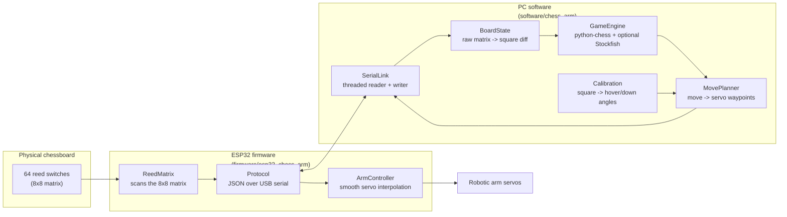

# Architecture

## Why the split is where it is

The ESP32 does no chess logic at all — it scans the matrix, reports raw
`row*8+col` occupancy, and executes `{angles, duration_ms}` motion commands.
Two reasons:

1. **Debuggability.** `python-chess`, move legality, castling/en passant
   edge cases, and an actual chess engine (Stockfish) are all trivial to
   pull in on the PC and painful to reimplement in C++ on a microcontroller.
2. **Iteration speed.** Move planning (`chess_arm.move_planner`) and
   calibration (`chess_arm.calibration`) change constantly while tuning the
   arm; reflashing the ESP32 for every tweak would slow that down a lot.
   Only the wiring-level firmware needs a reflash.

## Game loop (`chess_arm.main`)

1. Wait for a `board` event from the ESP32 whenever a human moves a piece.
2. Diff it against the last known state (`BoardState.update`) to get
   vacated/occupied squares.
3. Match the diff to a legal move (`GameEngine.infer_move_from_diff`) and
   push it.
4. If it's now the arm's turn: ask the engine for a move
   (`GameEngine.compute_next_move`, Stockfish if available, otherwise a
   random legal move so the whole pipeline still runs without extra
   binaries), turn it into a waypoint sequence
   (`MovePlanner.plan` — handles plain moves, captures, en passant and
   castling), and stream it to the ESP32 one waypoint at a time, waiting
   for an `ack` between each.
5. Repeat until `GameEngine.is_game_over`.

## Board-to-square mapping

The firmware only knows `(row, col)` indices into its matrix; it has no
idea which physical square is `e4`. That mapping
(`chess_arm.board_state.default_square_order`) is configurable on the PC
side because it depends entirely on how the board was wired and which way
it's mounted relative to the arm.
