# Architecture

The system is split across three independent pieces of hardware, each with a
single, narrow job: two ESP32s that only ever talk to the PC (never to each
other), and the PC that owns all the "thinking."

```mermaid
flowchart LR
    subgraph Board["Physical chessboard"]
        RS["64 reed switches\n(8x8 matrix)"]
        MUX["16-channel analog mux\n(CD74HC4067)\nreads the 8 columns"]
        RS --> MUX
    end

    subgraph ESP32B["ESP32 #2 -- board firmware\n(firmware/esp32_board)"]
        RM["ReedMatrix\ndrives rows, reads columns via mux"]
        PRB["Protocol\nJSON over USB serial"]
        RM --> PRB
    end

    subgraph ESP32A["ESP32 #1 -- arm firmware\n(firmware/esp32_arm)"]
        PRA["Protocol\nJSON over USB serial"]
        AC["ArmController\nsmooth interpolation, 5 joints"]
        PRA --> AC
    end

    subgraph PCA["PCA9685 PWM driver (I2C)"]
        CH["6 channels -> 6 MG996R servos"]
    end

    subgraph PC["PC software\n(software/chess_arm)"]
        SL1["SerialLink (board port)"]
        SL2["SerialLink (arm port)"]
        BS["BoardState\nraw matrix -> square diff"]
        GE["GameEngine\npython-chess + optional Stockfish"]
        MP["MovePlanner\nmove -> joint waypoints"]
        CAL["Calibration\nsquare -> hover/down angles"]

        SL1 --> BS
        BS --> GE
        GE --> MP
        CAL --> MP
        MP --> SL2
    end

    Arm["Robotic arm\n4 DOF + gripper"]

    MUX --> RM
    PRB -- "USB serial" --> SL1
    SL2 -- "USB serial" --> PRA
    AC --> PCA
    CH --> Arm
```

## Why two ESP32s instead of one

The board and the arm are physically far apart (the board sits under the
chessboard, the arm sits next to it) and have unrelated timing needs: the
board wants to scan its matrix on a steady tick, the arm wants to smoothly
interpolate motion on its own tick. Splitting them into two boards, each
with its own USB-serial link straight to the PC, means:

1. **No inter-microcontroller protocol to design or debug.** Both boards
   already need a JSON-over-serial link to the PC for their own reasons, so
   reusing that instead of adding a third UART/I2C hop between the two
   ESP32s keeps the wiring and the failure modes simpler.
2. **Independent failure/reset.** Re-flashing or resetting the arm
   controller (common while tuning motion) doesn't interrupt board sensing,
   and vice versa.
3. **Each board's pin budget stays comfortable.** The reed matrix (rows +
   mux) and the PCA9685 (2 I2C pins) never compete for GPIOs on the same
   chip.

The PC (`chess_arm.main`) simply opens two `SerialLink`s -- one per board --
and treats "board occupancy changed" and "arm move acked" as independent
events. See [`docs/protocol.md`](protocol.md) for the exact messages each
board speaks.

## Why the ESP32s do no chess logic at all

Both boards are intentionally "dumb": the board ESP32 reports raw
`row*8+col` occupancy, and the arm ESP32 executes `{angles, duration_ms}`
motion commands. Two reasons:

1. **Debuggability.** `python-chess`, move legality, castling/en passant
   edge cases, and an actual chess engine (Stockfish) are all trivial to
   pull in on the PC and painful to reimplement in C++ on a microcontroller.
2. **Iteration speed.** Move planning (`chess_arm.move_planner`) and
   calibration (`chess_arm.calibration`) change constantly while tuning the
   arm; reflashing an ESP32 for every tweak would slow that down a lot.
   Only the wiring-level firmware needs a reflash.

## Game loop (`chess_arm.main`)

1. Wait for a `board` event from the board ESP32 whenever a human moves a
   piece.
2. Diff it against the last known state (`BoardState.update`) to get
   vacated/occupied squares.
3. Match the diff to a legal move (`GameEngine.infer_move_from_diff`) and
   push it.
4. If it's now the arm's turn: ask the engine for a move
   (`GameEngine.compute_next_move`, Stockfish if available, otherwise a
   random legal move so the whole pipeline still runs without extra
   binaries), turn it into a waypoint sequence
   (`MovePlanner.plan` -- handles plain moves, captures, en passant and
   castling), and stream it to the arm ESP32 one waypoint at a time, waiting
   for an `ack` between each.
5. Repeat until `GameEngine.is_game_over`.

## Board-to-square mapping

The board firmware only knows `(row, col)` indices into its matrix; it has
no idea which physical square is `e4`. That mapping
(`chess_arm.board_state.default_square_order`) is configurable on the PC
side because it depends entirely on how the board was physically wired and
which way it's mounted relative to the arm.

## Joint-to-servo mapping

Symmetrically, the arm firmware only knows about 6 PCA9685 channels; it has
no idea those correspond to "base/shoulder/elbow/wrist/gripper." The 5-joint
`move` command it receives gets expanded to 6 channels internally
(`JOINT_CHANNELS` in `firmware/esp32_arm/src/config.h`), since the shoulder
joint is driven by two servos in parallel. Everything upstream of the
firmware -- move planning, calibration -- stays in clean 5-joint terms and
never needs to know the shoulder is doubled up.
